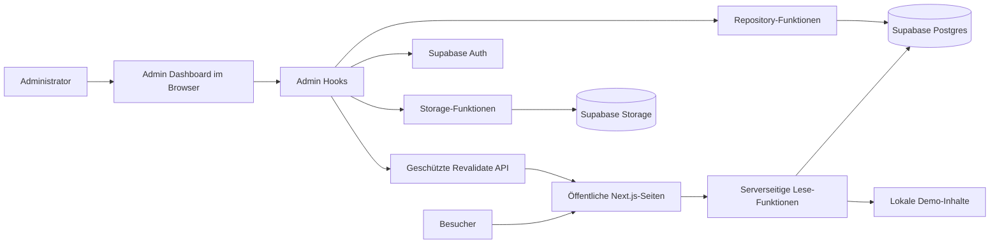
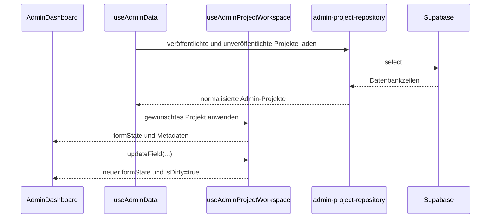
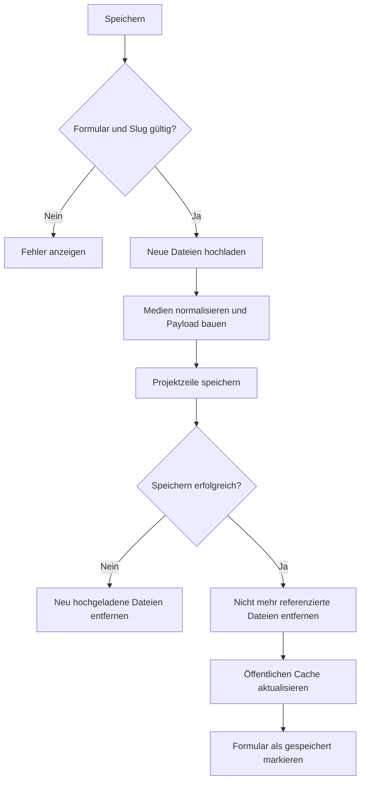

# Developer onboarding

Dieser Leitfaden erklärt die Codebasis aus Sicht einer Person, die React,
TypeScript, Next.js oder Supabase noch nicht lange verwendet. Er ersetzt keine
Dokumentation dieser Technologien. Er zeigt, wie sie in diesem Projekt
zusammenarbeiten und an welcher Stelle eine Änderung sicher vorgenommen werden
kann.

## Das mentale Modell in zehn Minuten

Die Anwendung besteht aus zwei weitgehend getrennten Bereichen:

- Die öffentliche Website liest veröffentlichte Projekte und globale
  Seiteneinstellungen. Sie rendert möglichst viel auf dem Server.
- Das Admin Panel läuft im Browser. Es hält Formulare, lokale Dateiauswahl und
  Vorschauen im React-Zustand und schreibt Änderungen nach einer erfolgreichen
  Anmeldung in Supabase.

Supabase übernimmt im Live-Betrieb drei Aufgaben:

- Authentifizierung der Administratoren
- Speicherung strukturierter Daten in Postgres
- Speicherung von Bildern und Videos im Storage-Bucket

Ohne konfigurierte Supabase-Umgebungsvariablen verwendet die öffentliche
Website Demo-Inhalte. Das Admin Panel bleibt als Demo bedienbar, aber Änderungen
werden nicht in die produktive Datenbank geschrieben.



Die Pfeile beschreiben Verantwortlichkeiten, nicht zwingend einzelne
Netzwerkaufrufe.

## Verzeichnisübersicht

### `app/`

Next.js verwendet die Ordnerstruktur als Routing-Tabelle.

- `app/(site)/` enthält die öffentlichen Seiten. Die Klammern gruppieren
  Dateien, erscheinen aber nicht in der URL.
- `app/(site)/work/[slug]/` ist eine dynamische Projektseite. `[slug]` wird
  beispielsweise für `/work/porsche-911` durch `porsche-911` ersetzt.
- `app/admin/` lädt das Admin Panel.
- `app/api/` enthält serverseitige HTTP-Endpunkte. Browser-Code kann diese über
  `fetch` aufrufen, sensible Schlüssel bleiben dabei auf dem Server.
- `layout.tsx`, `template.tsx`, `loading.tsx`, `error.tsx` und `not-found.tsx`
  sind spezielle Next.js-Dateien.

### `components/`

Komponenten übersetzen Daten und Zustand in sichtbares HTML.

- `components/sections/` enthält größere Bereiche öffentlicher Seiten.
- `components/layout/` enthält Header und Footer.
- `components/ui/` enthält kleine, wiederverwendbare Bausteine.
- `components/admin/` enthält die Oberfläche des Admin Panels. Diese Dateien
  sollten möglichst wenig Datenbanklogik enthalten.

### `hooks/`

Hooks bündeln zustandsbehaftete Browser-Logik. Ein Hook beginnt per Konvention
mit `use`.

- `use-admin-data.ts` verbindet alle Admin-Teilbereiche und ist der zentrale
  Einstiegspunkt.
- `use-admin-project-workspace.ts` verwaltet das aktuell ausgewählte Projekt,
  Formularänderungen, Dirty State, Slug-Prüfung und Projektdialoge.
- `use-admin-media.ts` verwaltet noch nicht hochgeladene lokale Dateien.
- `use-admin-site-settings.ts` lädt und speichert globale Einstellungen.
- `use-admin-session.ts` verwaltet Anmeldung und Berechtigungsprüfung.
- `use-admin-draft.ts` schützt ungespeicherte Projekttexte über
  `localStorage`.

### `lib/`

`lib/` enthält die fachliche Logik und die Schnittstellen zu externen Systemen.
Diese Funktionen sind bevorzugte Ziele für Unit-Tests.

- `supabase.ts` enthält öffentliche Lesezugriffe und normalisiert
  Datenbankzeilen in die internen Typen.
- `admin-*-repository.ts` kapselt Datenbankoperationen des Admin Panels.
- `admin-storage.ts` kapselt Upload, Löschung und Cache-Aktualisierung.
- `admin-persistence.ts` baut aus Formularzustand gültige Datenbank- und
  Demo-Objekte.
- `admin-utils.ts` enthält Formular-Konvertierung, Slugs, Vollständigkeitschecks
  und Textformate.
- `types.ts` beschreibt die Daten, mit denen die öffentliche Website arbeitet.
- `admin-types.ts` beschreibt den internen Zustand des Admin Panels.

### `supabase/`

- `migrations/` ist die versionierte Historie des Datenbankschemas.
- `schema.sql` ist eine gut lesbare Gesamtdarstellung des erwarteten Schemas.

Eine bestehende Migration wird nach dem Livegang nicht nachträglich verändert.
Korrekturen werden als neue Migration ergänzt.

### `tests/`

- Unit-Tests prüfen kleine Funktionen und Datenumwandlungen.
- Playwright-Tests öffnen die Anwendung in echten Browsern und prüfen komplette
  Benutzerabläufe.
- Axe-Tests prüfen automatisierbare Regeln der Barrierefreiheit.

## Server- und Client-Code unterscheiden

Dateien mit `"use client"` am Anfang laufen im Browser. Dort sind React Hooks,
Event Handler, `window`, `localStorage` und Dateiauswahl erlaubt.

Dateien ohne diese Direktive sind im App Router zunächst Server-Komponenten.
Sie können Daten vor dem Rendern laden, dürfen aber keine Browser-Hooks wie
`useState` verwenden.

Wichtige Sicherheitsregel: Ein Wert mit dem Präfix `NEXT_PUBLIC_` wird in den
Browser ausgeliefert. Geheime Schlüssel wie `SUPABASE_SERVICE_ROLE_KEY` dürfen
nie dieses Präfix tragen und nur in Server-Code verwendet werden.

## Die wichtigsten Zustandsarten im Admin Panel

Die ähnlichen Begriffe haben unterschiedliche Bedeutungen:

| Zustand               | Bedeutung                                                        | Typischer Speicherort            |
| --------------------- | ---------------------------------------------------------------- | -------------------------------- |
| Gespeichertes Projekt | Letzter bestätigter Datenbankstand                               | Supabase und `projects` State    |
| `formState`           | Aktuell sichtbare Text- und URL-Felder                           | `use-admin-project-workspace.ts` |
| Queued Media          | Vom Benutzer ausgewählte, noch nicht hochgeladene `File`-Objekte | `use-admin-media.ts`             |
| Preview URL           | Temporäre Browser-URL für eine lokale Datei                      | `use-admin-media.ts`             |
| Saved snapshot        | Serialisierte Referenz für den Dirty-Vergleich                   | Workspace-Hooks                  |
| Recovery draft        | Sicherheitskopie ungespeicherter Formularfelder                  | `localStorage`                   |
| Save report           | Ergebnis und Warnungen des letzten Speichervorgangs              | `use-admin-data.ts`              |

`isDirty` bedeutet daher nicht nur „Text wurde geändert“. Auch eine ausgewählte,
aber noch nicht hochgeladene Datei macht ein Projekt oder die Site Settings
dirty.

## Ablauf: Projekt öffnen und bearbeiten



`AdminDashboard` verteilt den Zustand an Editor, Sidebar und Live Preview. Die
Komponenten speichern nicht selbst. Dadurch zeigen Editor und Vorschau immer
dieselbe Zustandsquelle.

Beim Wechsel zu einem anderen Projekt verhindert `useAdminData` einen stillen
Datenverlust: Bei Dirty State erscheint ein Dialog zum Speichern, Verwerfen oder
Abbrechen.

## Ablauf: Projekt inklusive Medien speichern

Der Speichervorgang in `use-admin-data.ts` ist absichtlich orchestriert und
mehrstufig:

1. Pflichtfelder und Projektvollständigkeit prüfen.
2. Den Slug normalisieren und auf Konflikte prüfen.
3. Neu ausgewählte Dateien in Supabase Storage hochladen.
4. Bestehende URLs und neue Upload-URLs zu einem konsistenten Medienzustand
   zusammenführen.
5. Daraus den Datenbank-Payload erzeugen.
6. Das Projekt mit Optimistic-Concurrency-Schutz speichern.
7. Nur noch unreferenzierte ersetzte Dateien entfernen.
8. Den Cache der öffentlichen Website aktualisieren.
9. Den lokalen Projektzustand und den Saved Snapshot aktualisieren.



Die Reihenfolge ist wichtig. Würde zuerst die alte Datei gelöscht und der
Datenbank-Write danach fehlschlagen, könnte das veröffentlichte Projekt auf eine
nicht mehr vorhandene Datei zeigen.

Im Demo-Modus wird kein echter Upload ausgeführt. Lokale `File`-Objekte können
nicht dauerhaft als öffentliche URL gespeichert werden; der Save Report weist
darauf hin.

## Ablauf: Site Settings speichern

Site Settings verwenden einen eigenen Hook, weil sie eine andere Datenstruktur
und andere Mediengruppen haben:

1. Der Hook lädt den Datensatz mit der festen ID `global`.
2. Textänderungen aktualisieren `SiteSettingsFormState`.
3. Hero-Video, Selected Frames und Team-Bilder bleiben bis zum Speichern als
   lokale Dateien vorgemerkt.
4. Beim Speichern werden die Dateien hochgeladen und ihre URLs an genau den
   vorgesehenen Positionen in den Formularzustand eingesetzt.
5. `buildSiteSettingsDatabasePayload` übersetzt den Formularzustand in
   Datenbankspalten.
6. Nach erfolgreichem Write werden alte, nirgends mehr referenzierte Dateien
   bereinigt und der öffentliche Cache aktualisiert.

Für Fehler in diesem Ablauf zuerst diese Dateien lesen:

1. `hooks/use-admin-site-settings.ts`
2. `lib/admin-persistence.ts`
3. `lib/admin-site-settings-repository.ts`
4. `lib/admin-storage.ts`

## Warum es Repository- und Normalisierungsfunktionen gibt

Supabase liefert Datenbankspalten in `snake_case`, zum Beispiel
`cover_image`. React und TypeScript verwenden intern `camelCase`, zum Beispiel
`coverImage`.

Die Übersetzung findet zentral statt:

- Datenbank nach Anwendung: Normalisierer in `lib/supabase.ts`
- Anwendung nach Datenbank: Payload Builder in `lib/admin-persistence.ts`
- Eigentliche Admin-Abfragen: Repository-Dateien

Komponenten sollten keine Supabase-Zeilennamen kennen. Neue Datenbankfelder
erfordern meistens Anpassungen am Typ, an beiden Übersetzungsrichtungen, am
Formular und an einer Migration.

## Authentifizierung und RLS

Eine erfolgreiche Anmeldung allein reicht nicht für Admin-Zugriff. Nach dem
Login prüft `use-admin-session.ts`, ob der Benutzer durch die
`is_admin()`-Datenbankfunktion autorisiert ist.

Row Level Security (RLS) ist die tatsächliche Sicherheitsgrenze. Eine im Browser
ausgeblendete Schaltfläche ist nur Benutzeroberfläche und kein Zugriffsschutz.
Admin-Tabellen und der Storage-Bucket müssen daher auch dann Zugriffe ablehnen,
wenn jemand die API direkt anspricht.

## React-Begriffe, die hier häufig vorkommen

- `useState` speichert einen Wert zwischen Render-Vorgängen.
- `useEffect` synchronisiert React mit etwas außerhalb von React, etwa
  Browser-Events, Auth-Subscriptions oder `localStorage`.
- `useMemo` merkt sich einen berechneten Wert, bis sich seine Abhängigkeiten
  ändern.
- `useCallback` stabilisiert eine Funktionsreferenz für andere Hooks oder
  Komponenten.
- `useRef` speichert einen veränderbaren Wert, ohne dadurch ein Rendering
  auszulösen.
- Ein Custom Hook kombiniert diese Bausteine zu einer fachlichen Einheit.
- Props sind Eingaben einer Komponente. Callback-Props melden Ereignisse an die
  besitzende Komponente zurück.

Die Dependency-Liste eines Hooks ist Teil seiner Korrektheit. Sie sollte nicht
entfernt werden, nur um eine Lint-Warnung verschwinden zu lassen.

## Empfohlener Leseweg

### Öffentliche Website verstehen

1. `app/(site)/page.tsx`
2. `components/sections/featured-projects.tsx`
3. `lib/supabase.ts`
4. `lib/types.ts`
5. `app/(site)/work/[slug]/page.tsx`

### Admin Panel verstehen

1. `app/admin/page.tsx`
2. `components/admin/admin-dashboard.tsx`
3. `hooks/use-admin-data.ts`
4. `hooks/use-admin-project-workspace.ts`
5. `hooks/use-admin-media.ts`
6. `lib/admin-persistence.ts`
7. `lib/admin-project-repository.ts`
8. `lib/admin-storage.ts`

### Site Settings verstehen

1. `components/admin/site-settings-form.tsx`
2. `hooks/use-admin-site-settings.ts`
3. `lib/admin-site-settings-repository.ts`
4. `components/admin/site-settings-preview.tsx`

## Sichere Vorgehensweise für typische Änderungen

### Ein neues Projektfeld ergänzen

1. Datenbankmigration hinzufügen.
2. Datenbankzeilentyp in `lib/supabase.ts` ergänzen.
3. Öffentlichen `Project`-Typ in `lib/types.ts` ergänzen.
4. `ProjectFormState` in `lib/admin-types.ts` ergänzen.
5. Normalisierung von Datenbank zu Anwendung ergänzen.
6. `toFormState` und Payload Builder ergänzen.
7. Formular und Live Preview ergänzen.
8. Unit-Test für beide Übersetzungsrichtungen hinzufügen.
9. Admin-Speichern und öffentliche Projektseite im Browser testen.

### Ein neues Site-Settings-Feld ergänzen

1. Migration und Supabase-Zeilentyp ergänzen.
2. `SiteSettings` und `SiteSettingsFormState` ergänzen.
3. Normalisierer, Formular-Konvertierung und Payload Builder ergänzen.
4. Editor und zugehörige Preview ergänzen.
5. Laden, Dirty State, Speichern und Reset testen.

### Eine neue Mediengruppe ergänzen

Zusätzlich zu den obigen Schritten müssen Dateiauswahl, Validierung,
Upload-Zielordner, Upload-Fortschritt, Fehler-Rollback und sichere Bereinigung
berücksichtigt werden. Eine URL darf erst aus dem alten Datensatz entfernt
werden, nachdem der neue Datensatz erfolgreich gespeichert wurde.

## Fehlersuche nach Symptom

| Symptom                                                  | Zuerst prüfen                                         |
| -------------------------------------------------------- | ----------------------------------------------------- |
| Editor zeigt falsche Werte                               | `toFormState` und `use-admin-project-workspace.ts`    |
| Speichern verliert ein Feld                              | Payload Builder in `admin-persistence.ts`             |
| Gespeicherte Bilder erscheinen nicht                     | Medienzusammenführung und Supabase-Normalisierung     |
| Upload bleibt hängen                                     | `admin-storage.ts`, Auth-Session und Storage-Policies |
| Änderungen sind im Admin sichtbar, öffentlich aber nicht | Revalidate-Endpunkt und Cache-Aktualisierung          |
| Projektwechsel verliert Text                             | Dirty State, Workflow-Dialog und `use-admin-draft.ts` |
| Site Settings springen zurück                            | Saved Snapshot und `use-admin-site-settings.ts`       |
| Zugriff trotz Login verweigert                           | `admin_users`, `is_admin()` und RLS                   |

## Qualitätsprüfung

Die verfügbaren Befehle sind in `docs/project-scripts.md` erklärt. Für eine
normale Änderung mindestens ausführen:

```text
npm run format:check
npm run lint
npm run typecheck
npm test
```

Bei Änderungen an Navigation, Formularen, Medien oder responsivem Verhalten
zusätzlich die passenden Playwright-Tests ausführen. Datenbankmigrationen
benötigen außerdem den Migrationscheck und idealerweise einen frischen lokalen
Supabase-Reset.

## Kommentarregeln für neue Beiträge

Kommentare sollen beim Lernen helfen, ohne den Code doppelt zu erzählen:

- Öffentliche, nicht triviale Funktionen dokumentieren Zweck, Eingaben,
  Rückgabe, Seiteneffekte und relevante Fehler.
- Große Orchestrierungsdateien beginnen mit einer kurzen
  Verantwortlichkeitsbeschreibung.
- Kommentare erklären Invarianten und Reihenfolgen, die beim Refactoring leicht
  verletzt werden können.
- Offensichtliche Zuweisungen, JSX-Struktur und CSS-Klassen werden nicht
  zeilenweise kommentiert.
- Wird das Verhalten geändert, muss der zugehörige Kommentar im selben Commit
  aktualisiert werden.

So bleibt die Dokumentation für Einsteiger nützlich, ohne zu einer zweiten,
veralteten Kopie des Codes zu werden.
